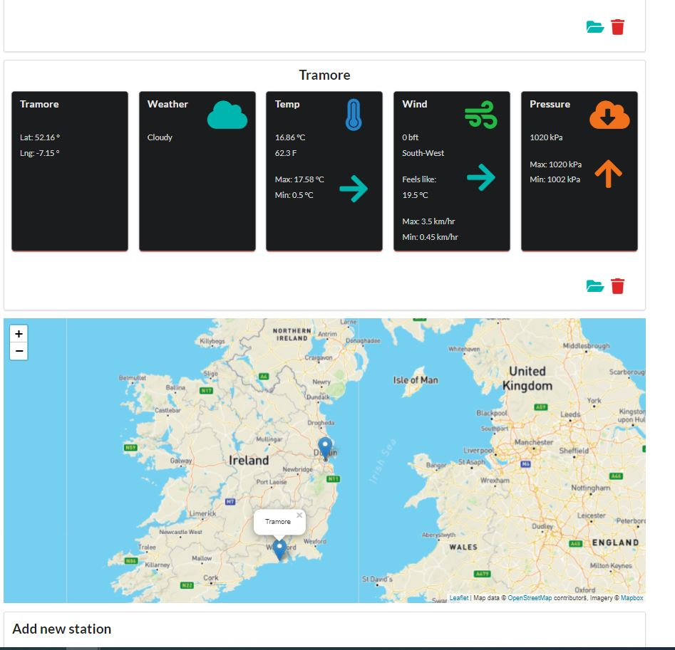
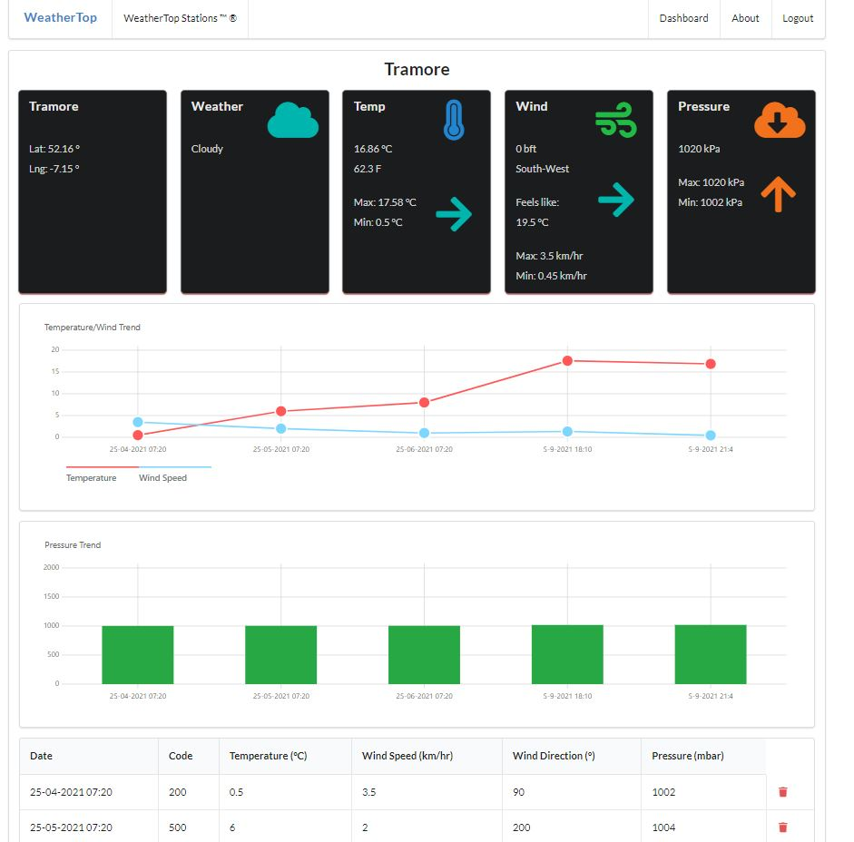

Weather-top-web-application
==============================

**This is a web application that allows users to add weather readings of different locations using Express framework.**

- Accessible at https://weather-top-js-vy.glitch.me/

Created using Glitch development environment. It includes basic express
setup, templating, routing, JSON based model and session support.

## Visual
- A summary display of weather reading and any trends in the weather readings are automatically generated.
- A map showing the location of the weather stations.
  

  
- CRUD features for the weather readings.
  

